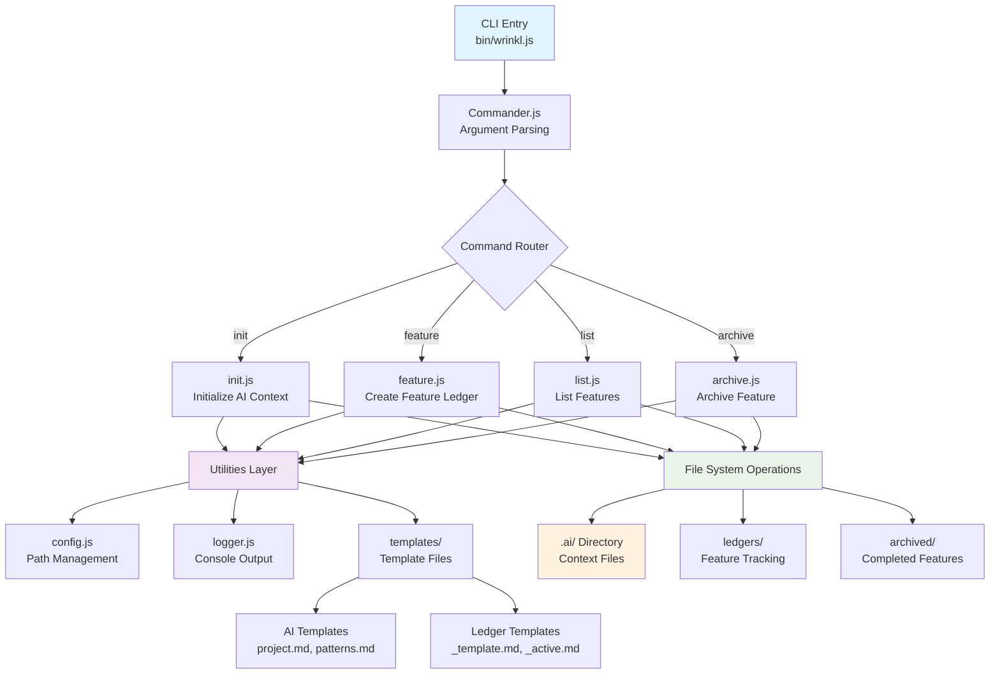

# System Architecture

This document describes the high-level architecture and design decisions for Wrinkl CLI tool.

## Architecture Overview



> **Note**: This diagram uses [Mermaid](https://mermaid.js.org/), a markdown-based diagramming tool that creates flowcharts, sequence diagrams, and other visualizations from simple text syntax. Most modern markdown viewers support Mermaid rendering, including GitHub, GitLab, and VS Code with the [Markdown Preview Mermaid Support](https://marketplace.visualstudio.com/items?itemName=bierner.markdown-mermaid) extension.

## Core Components

### CLI Entry Point
- **Entry**: `bin/wrinkl.js` - Executable script with shebang
- **Framework**: Commander.js for command parsing and help generation
- **Arguments**: Command-line argument parsing and validation
- **Version**: Dynamic version reading from package.json

### Command Layer
- **init.js**: Initialize AI context system in project directory
- **feature.js**: Create new feature ledgers with interactive prompts
- **list.js**: Display active and archived features with status
- **archive.js**: Move completed features to archived directory

### Utility Layer
- **config.js**: Path management, validation, and project configuration
- **logger.js**: Colored console output with emoji and formatting
- **templates/**: Template files for AI context and feature ledgers

## Data Flow

### Command Execution Flow
1. User runs `wrinkl <command>` in terminal
2. `bin/wrinkl.js` parses command and options using Commander.js
3. Appropriate command module is imported and executed
4. Command validates project state and user input
5. File system operations are performed (read/write templates)
6. User feedback is provided through colored logger output

### Template Processing Flow
```
Template File → Read → Variable Substitution → Write to Target → Update Active List
```

## Design Decisions

### Decision 1: ES Modules over CommonJS
**Decision**: Use ES modules (`import`/`export`) throughout the codebase
**Reasoning**: Modern JavaScript standard, better tree-shaking, cleaner syntax
**Trade-offs**: Requires Node.js 14+ but provides better developer experience
**Date**: Project inception

### Decision 2: Synchronous File Operations
**Decision**: Use synchronous fs operations instead of async/await
**Reasoning**: CLI operations are short-lived, simpler error handling, sequential execution
**Trade-offs**: Blocks event loop but provides predictable execution order
**Date**: Initial implementation

### Decision 3: Template String Substitution
**Decision**: Simple string replacement over template engines
**Reasoning**: Minimal dependencies, easy to understand, sufficient for use case
**Trade-offs**: Less powerful than Handlebars/Mustache but much simpler
**Date**: Template system design

## File System Architecture

### Directory Structure
```
.ai/
├── README.md              # Overview of AI context system
├── project.md             # Project-specific information
├── patterns.md            # Coding patterns and conventions
├── architecture.md        # System architecture (this file)
├── context-rules.md       # Rules for AI assistants
└── ledgers/
    ├── _active.md         # Dashboard of active features
    ├── _template.md       # Template for new ledgers
    ├── archived/          # Completed feature ledgers
    └── [feature-name].md  # Individual feature ledgers
```

### File Operation Patterns
- **Read-Modify-Write**: For updating existing files (e.g., _active.md)
- **Template-Copy**: For creating new files from templates
- **Atomic Operations**: Single file operations to prevent corruption
- **Validation**: Input validation before file operations

## CLI Design Patterns

### Command Structure
```
wrinkl <command> [arguments] [options]
```

### User Experience Patterns
- **Interactive Prompts**: Use prompts for required information
- **Colored Output**: Chalk for status indication and readability
- **Progress Feedback**: Ora spinners for longer operations
- **Error Recovery**: Helpful error messages with suggestions

### Validation Strategy
- **Input Validation**: Feature names, project types, file paths
- **State Validation**: Check if .ai directory exists before operations
- **File Validation**: Verify templates exist before copying
- **User Confirmation**: Confirm destructive operations (archive, overwrite)

## Template System

### Template Processing
1. Read template file from `src/templates/`
2. Perform variable substitution using string replacement
3. Write processed content to target location
4. Update related files (e.g., _active.md for new features)

### Variable Substitution
- `PROJECT_NAME` → User-provided or directory name
- `PROJECT_TYPE` → User-provided project type
- `STACK` → User-provided technology stack
- `DATE` → Current date in YYYY-MM-DD format
- `[Feature Name]` → Feature name in ledger templates

## Error Handling Strategy

### CLI Error Handling
- **Validation Errors**: Clear messages with correction suggestions
- **File System Errors**: Permission issues, missing files, disk space
- **User Cancellation**: Graceful exit when user cancels prompts
- **Similar Name Suggestions**: Levenshtein distance for typo correction

### Recovery Mechanisms
- **Overwrite Protection**: Confirm before overwriting existing files
- **Rollback**: No partial state changes (atomic operations)
- **Helpful Messages**: Guide users to correct common issues
- **Exit Codes**: Proper exit codes for scripting integration

## Performance Considerations

### CLI Performance
- **Fast Startup**: Minimal imports and lazy loading where possible
- **File Operations**: Efficient file reading/writing patterns
- **Memory Usage**: Process files in chunks for large templates
- **Caching**: Template path resolution caching

### User Experience
- **Responsive Feedback**: Immediate acknowledgment of user actions
- **Progress Indication**: Spinners for operations > 100ms
- **Batch Operations**: Group related file operations
- **Minimal Dependencies**: Keep package size small for fast installs

## Future Considerations

### Planned Improvements
- Plugin system for custom templates
- Configuration file support (.wrinklrc)
- Git integration for automatic branch creation
- Export functionality for sharing context

### Technical Debt
- Add comprehensive error handling tests
- Implement async file operations for large projects
- Add template validation and linting
- Improve cross-platform path handling

## References

- [Commander.js Documentation](https://github.com/tj/commander.js)
- [Node.js File System API](https://nodejs.org/api/fs.html)
- [ES Modules in Node.js](https://nodejs.org/api/esm.html)
- [CLI Best Practices](https://clig.dev/)
