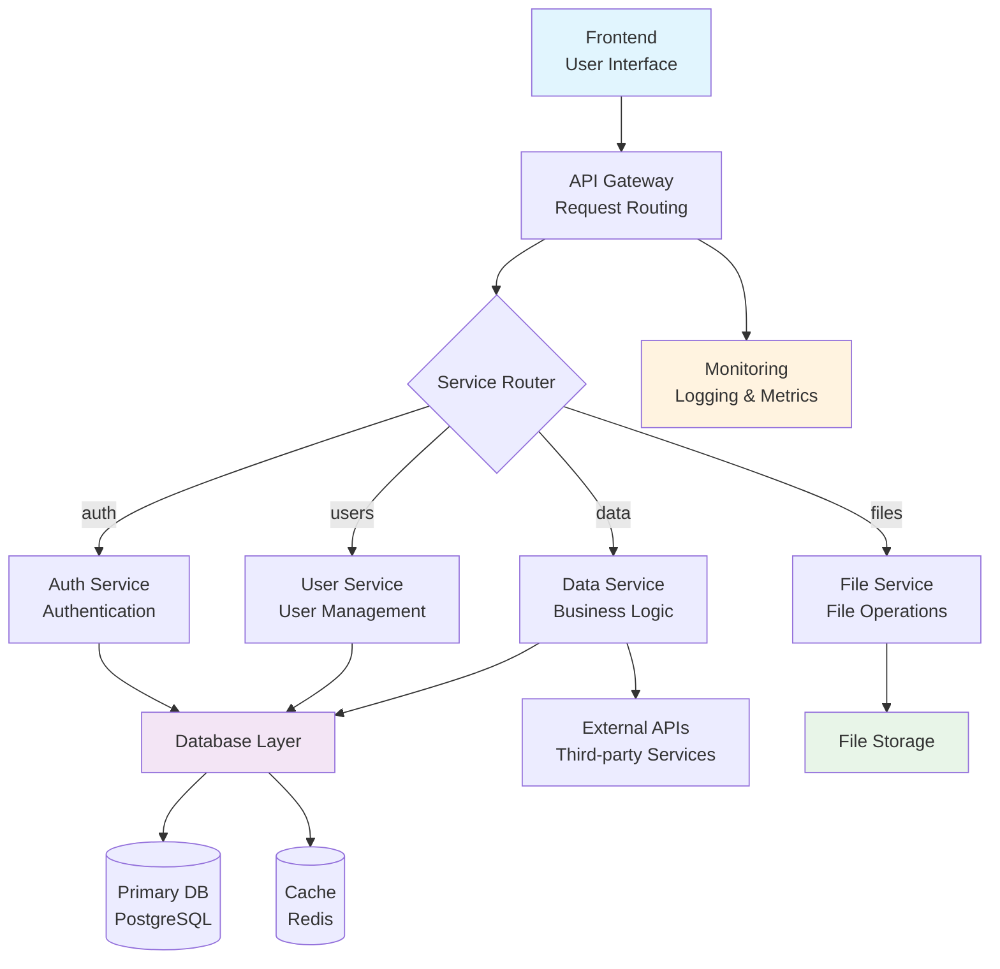

# System Architecture

This document describes the high-level architecture and design decisions for this project.

## Architecture Overview



> **Note**: This diagram uses [Mermaid](https://mermaid.js.org/), a markdown-based diagramming tool that creates flowcharts, sequence diagrams, and other visualizations from simple text syntax. Most modern markdown viewers support Mermaid rendering, including GitHub, GitLab, and VS Code with the [Markdown Preview Mermaid Support](https://marketplace.visualstudio.com/items?itemName=bierner.markdown-mermaid) extension.

## Core Components

### Frontend Architecture
- **Framework**: [Framework name and version]
- **State Management**: [Redux, Zustand, Context, etc.]
- **Routing**: [React Router, Next.js, etc.]
- **Styling**: [CSS Modules, Styled Components, Tailwind, etc.]

### Backend Architecture
- **Runtime**: [Node.js, Python, etc.]
- **Framework**: [Express, FastAPI, etc.]
- **Database**: [PostgreSQL, MongoDB, etc.]
- **Caching**: [Redis, Memcached, etc.]
- **Authentication**: [JWT, OAuth, etc.]

### Infrastructure
- **Hosting**: [AWS, Vercel, Heroku, etc.]
- **CDN**: [CloudFront, Cloudflare, etc.]
- **Monitoring**: [DataDog, New Relic, etc.]
- **CI/CD**: [GitHub Actions, Jenkins, etc.]

## Data Flow

### Request Lifecycle
1. User interaction triggers frontend action
2. Frontend makes API request to backend
3. Backend validates request and checks authentication
4. Backend processes business logic
5. Backend queries database if needed
6. Backend returns response to frontend
7. Frontend updates UI based on response

### State Management Flow
```
User Action → Dispatch → Reducer → Store → Component Re-render
```

## Design Decisions

### Decision 1: [Technology Choice]
**Decision**: Chose [technology] over [alternative]
**Reasoning**: [Why this decision was made]
**Trade-offs**: [What we gained/lost]
**Date**: [When decided]

### Decision 2: [Architecture Pattern]
**Decision**: Implemented [pattern] for [use case]
**Reasoning**: [Why this pattern was chosen]
**Trade-offs**: [Benefits and drawbacks]
**Date**: [When decided]

## Security Architecture

### Authentication Flow
1. User provides credentials
2. Server validates credentials
3. Server issues JWT token
4. Client stores token securely
5. Client includes token in subsequent requests
6. Server validates token on each request

### Data Protection
- All data encrypted in transit (HTTPS)
- Sensitive data encrypted at rest
- Input validation on all endpoints
- SQL injection prevention
- XSS protection

## Performance Considerations

### Frontend Optimization
- Code splitting and lazy loading
- Image optimization and lazy loading
- Caching strategies (browser cache, CDN)
- Bundle size optimization

### Backend Optimization
- Database query optimization
- Caching frequently accessed data
- Connection pooling
- Rate limiting

### Database Design
- Proper indexing strategy
- Query optimization
- Connection pooling
- Read replicas for scaling

## Scalability Strategy

### Horizontal Scaling
- Load balancers for distributing traffic
- Microservices for independent scaling
- Database sharding if needed
- CDN for static assets

### Vertical Scaling
- Resource monitoring and alerting
- Auto-scaling based on metrics
- Performance profiling and optimization

## Monitoring & Observability

### Metrics to Track
- Response times
- Error rates
- User engagement
- System resource usage
- Database performance

### Logging Strategy
- Structured logging with consistent format
- Log levels: ERROR, WARN, INFO, DEBUG
- Centralized log aggregation
- Log retention policies

## Deployment Architecture

### Environments
- **Development**: Local development environment
- **Staging**: Pre-production testing environment
- **Production**: Live user-facing environment

### Deployment Process
1. Code pushed to repository
2. CI/CD pipeline triggered
3. Automated tests run
4. Build artifacts created
5. Deployment to staging
6. Manual/automated testing
7. Deployment to production

## API Design

### RESTful Principles
- Use HTTP methods appropriately (GET, POST, PUT, DELETE)
- Resource-based URLs
- Consistent response formats
- Proper HTTP status codes

### API Versioning
- Version in URL path: `/api/v1/users`
- Backward compatibility maintained
- Deprecation notices for old versions

## Error Handling Strategy

### Frontend Error Handling
- Global error boundary for React apps
- User-friendly error messages
- Fallback UI for broken components
- Error reporting to monitoring service

### Backend Error Handling
- Consistent error response format
- Proper HTTP status codes
- Error logging and monitoring
- Graceful degradation

## Future Considerations

### Planned Improvements
- [Future architectural changes]
- [Technology upgrades]
- [Performance optimizations]

### Technical Debt
- [Known issues to address]
- [Refactoring opportunities]
- [Legacy code to modernize]

## References

- [Link to external architecture docs]
- [Technology documentation]
- [Best practices guides]
